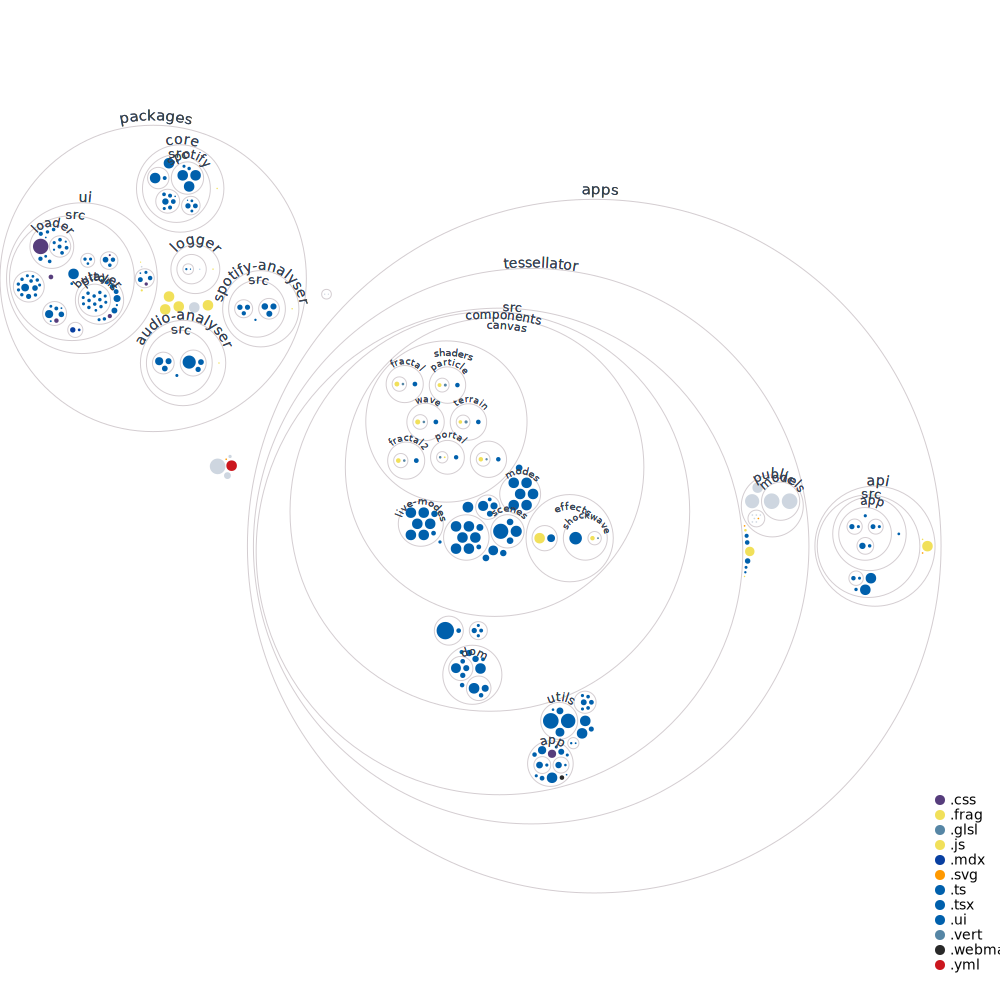

# Tessellator

A free to use 3-D music visualizer that uses a generative approach to create visualizations, with audio as the data source.

This repository contains the following:

- Node.js + express server `/apps/api`
- Next.js app `/apps/tessellator`
- `/packages/ui`
- `/packages/core`
- `/packages/spotify-analyser`
- `/packages/audio-analyser`
- `/packages/logger`
- `/packages/tsconfig`
- `/packages/eslint-config-custom-server`
- `/packages/eslint-config-custom`
- `/packages/eslint-config-base`
- `/packages/jest-presets`

## Prerequisites

- Node
- Yarn

## Getting started for local use

1.  `cp .env.example .env`
2.  edit .env
3.  `yarn`
4.  `yarn dev`

## Contributing

For information on opening your first PR check out our [contributing guide](./readme/CONTRIBUTING.md).

## Made with

### Authors

- **Nathan Menezes**
